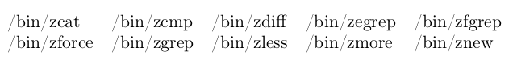
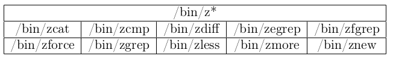
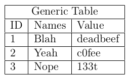

# Tex Table Generator (TTG)

## Usage

```
[TTG] python ttg.py -input <file> (default: stdin) --tex-options
[TTG] Tex Options: --title <title> (default: empty) --format <columns> (required) --position <position> (default: H) --align <alignment> (default: l) --title <title> (default:None) --borders (default:No) 
[TTG] Type -h for help
```

## Piping Terminal Commands

```
ls ~ | python ttg.py --format 3
```

### Basic Example

*Input*:

```
ls /bin/z* | python ttg.py --format 5
```

*Output*:

```
\begin{table}[H]
\begin{tabular}{lllll}
/bin/zcat  	&  /bin/zcmp  	&  /bin/zdiff  &  /bin/zegrep  	&  /bin/zfgrep \\
/bin/zforce  	&  /bin/zgrep  	&  /bin/zless  &  /bin/zmore  	&  /bin/znew 
\end{tabular}
\end{table}
```

*Generated PDF*:



### Complete Example

*Input*:

```
ls /bin/z* | python ttg.py --format 5 --title "/bin/z*" --align c --position '!hptb' --borders
```

*Output*:

```
\begin{table}[!hptb]
\begin{tabular}{|c|c|c|c|c|}
\hline
\multicolumn{5}{|c|}{/bin/z*} \\
\hline
/bin/zcat  	&  /bin/zcmp  	&  /bin/zdiff  &  /bin/zegrep  	&  /bin/zfgrep \\
\hline
/bin/zforce  	&  /bin/zgrep  	&  /bin/zless  &  /bin/zmore  	&  /bin/znew 
\\ \hline
\end{tabular}
\end{table}
```

*Generated PDF*:



## Reading From File

*Command*:

```
python ttg.py -input data.dat --format 3 --delimiter '\t' --borders --title "Generic Table"
```

### Example

*Input*:

```
ID	Names	Value
1	Blah	deadbeef
2	Yeah	c0fee
3	Nope	133t
```

*Output*:

```
\begin{table}[H]
\begin{tabular}{|l|l|l|}
\hline
\multicolumn{3}{|c|}{Generic Table} \\
\hline
ID  &  Names  &  Value \\
\hline
1  &  Blah  &  deadbeef \\
\hline
2  &  Yeah  &  c0fee \\
\hline
3  &  Nope  &  133t 
\\ \hline
\end{tabular}
\end{table}
```

*Generated PDF*:


